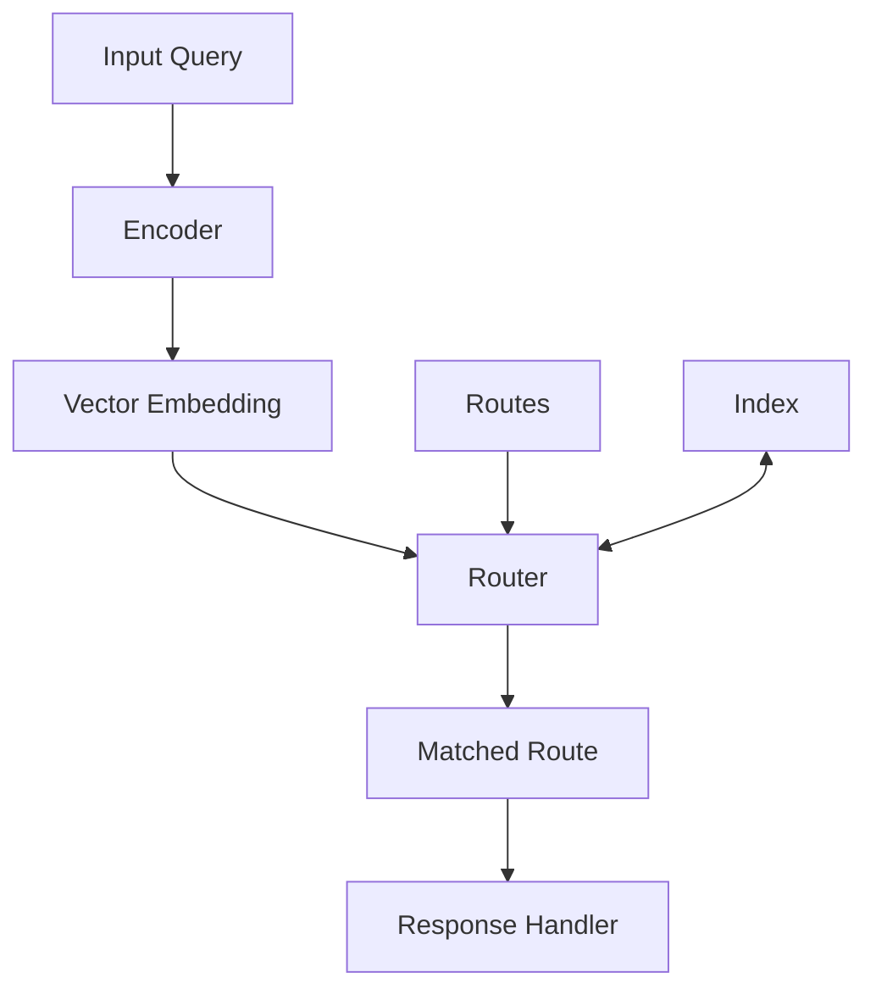
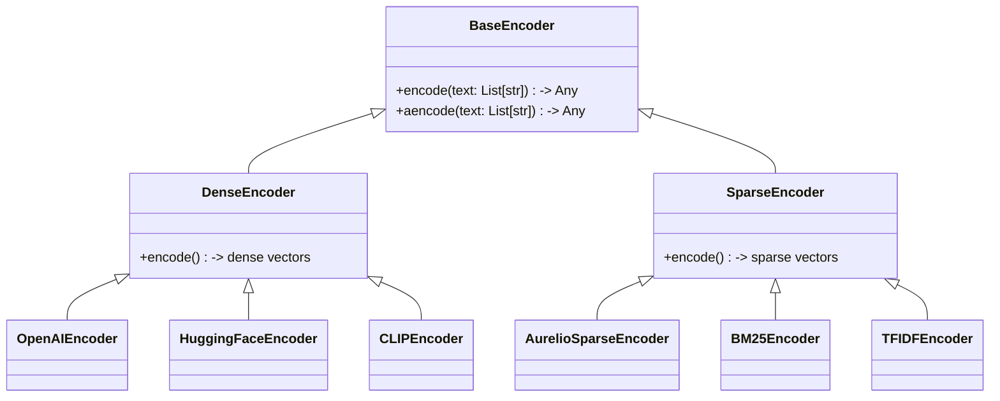
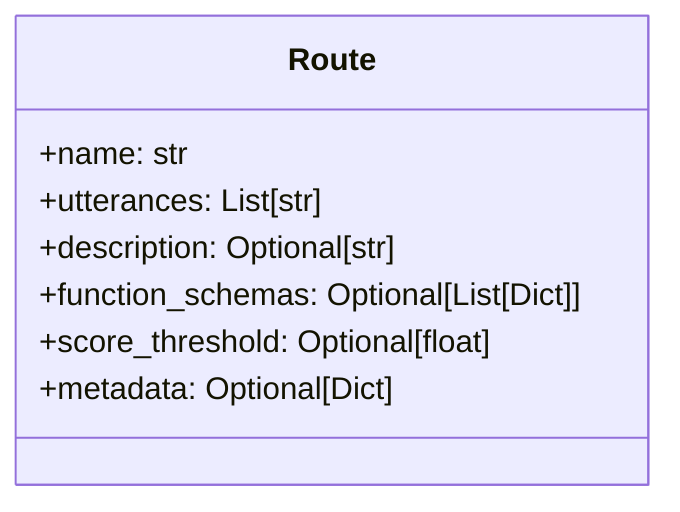
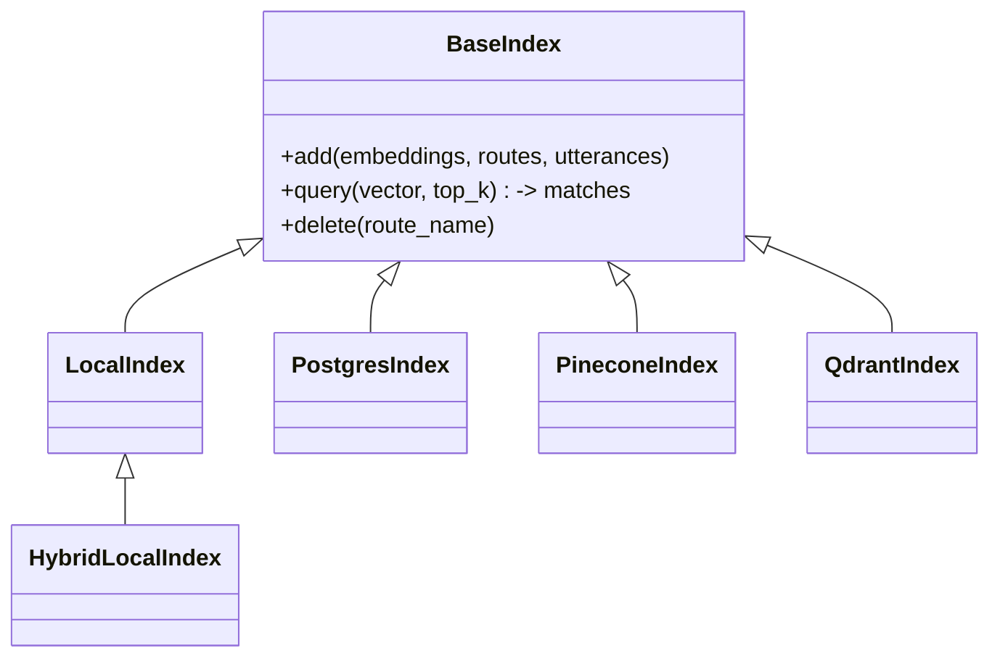
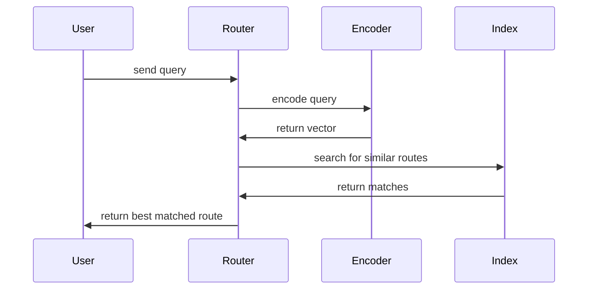
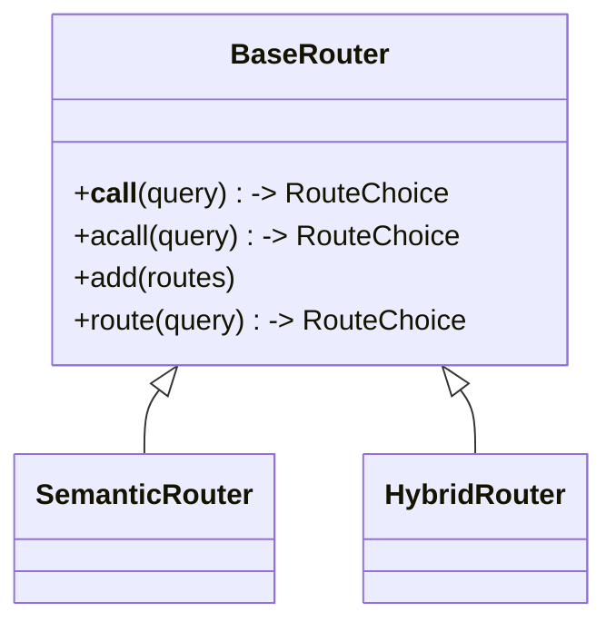

# Semantic Router: Technical Architecture

## System Overview

Semantic Router is built around three core components that work together to enable intelligent routing of inputs based on semantic meaning.



## Core Components

### 1. Encoders

Encoders transform inputs into vector representations in semantic space.



**Types of Encoders:**
- **Dense encoders**: Generate continuous vectors (OpenAI, HuggingFace, etc.)
- **Sparse encoders**: Generate sparse vectors (BM25, TFIDF, AurelioSparse, etc.)
- **Multimodal encoders**: Handle images and text (CLIP, ViT)

### 2. Routes

Routes define patterns to match against, with examples of inputs that should trigger them.



**Key properties:**
- **name**: Identifier for the route
- **utterances**: Example inputs that should match this route
- **function_schemas**: Optional specifications for function calling
- **score_threshold**: Minimum similarity score required to match

### 3. Indexing Systems

Indexes store and retrieve route vectors efficiently.



**Index types:**
- **LocalIndex**: In-memory vector storage for dense embeddings
- **HybridLocalIndex**: In-memory storage supporting both dense and sparse vectors
- **PineconeIndex/QdrantIndex**: Cloud-based vector DBs
- **PostgresIndex**: SQL-based vector storage

## Data Flow



1. **Input Reception**: The system receives an input (text, image)
2. **Encoding**: The input is transformed into a vector representation
3. **Retrieval**: The vector is compared against stored route vectors
4. **Matching**: The best matching route is selected based on similarity
5. **Response**: The system returns the matched route, enabling appropriate handling

## Router Types



- **SemanticRouter**: Uses dense vector embeddings for semantic matching
- **HybridRouter**: Combines both dense and sparse vectors for enhanced accuracy

## Integration Example

```python
from semantic_router import Route, SemanticRouter
from semantic_router.encoders import OpenAIEncoder

# 1. Define routes
weather_route = Route(name="weather", utterances=["What's the weather like?"])
greeting_route = Route(name="greeting", utterances=["Hello there!", "Hi!"])

# 2. Initialize encoder
encoder = OpenAIEncoder()

# 3. Create router with routes
router = SemanticRouter(encoder=encoder, routes=[weather_route, greeting_route])

# 4. Route an incoming query
result = router("What's the forecast for tomorrow?")
print(result.name)  # "weather"
```

## Performance Considerations

- **In-memory vs. Vector DB**: Choose based on scale and latency requirements
- **Encoder selection**: Balance accuracy vs. speed based on use case
- **Batch processing**: Use batch methods for higher throughput
- **Async support**: Available for high-concurrency environments and applications relying
on heavy network use
