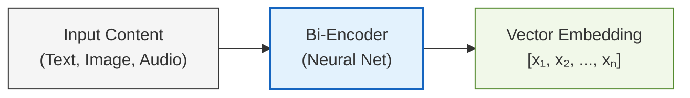
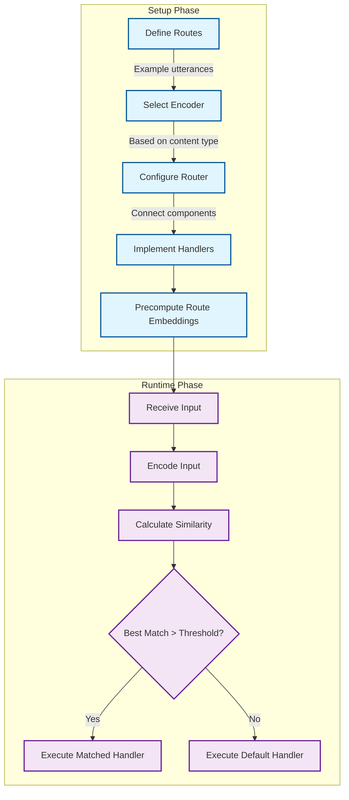

Semantic Routing is an approach to directing inputs (like text, images, or audio) to the appropriate handlers based on their meaning rather than rigid keyword matching or rule-based systems. It provides a more flexible and human-like understanding of content, allowing systems to gracefully handle the natural variability in how people express similar ideas.

## Semantic Space

Semantic space is a high-dimensional mathematical space where meaning is represented geometrically. Imagine a vast coordinate system where every point corresponds to a specific concept or idea. In this space, the sentence "I need help with my password" exists as a point near "Can't log in to my account" but far from "What's the weather forecast?" Semantic similarity becomes a measurable distance, transforming abstract meaning into computable relationships.

- Each point (vector) represents the meaning of a piece of content
- Distance between points represents semantic difference
- Content with similar meanings cluster together, regardless of exact wording

This approach allows us to capture the nuanced relationships between concepts, accommodating synonyms, paraphrases, and related ideas without explicitly programming each variation.

### Encoders

To place content in a semantic space, we need to convert it into vector representations – a process called **encoding**. This is handled by neural network models called **bi-encoders** (commonly known as embedding
models or encoders) which:

1. Process the input content (text, image, etc.)
2. Analyze its features and semantic properties
3. Output a fixed-size vector of floating-point numbers (typically hundreds or thousands of dimensions)

For example, the sentence "How's the weather today?" might be encoded as a vector like `[0.12, -0.34, 0.56, ...]`, while "What's the temperature outside?" would produce a different but nearby vector, reflecting their similar meanings.

Semantic Router supports various encoder types:

- **Dense encoders** (like `OpenAIEncoder` or `HuggingFaceEncoder`): Generate vectors where every dimension has a value, capturing complex semantic relationships
- **Sparse encoders** (like `AurelioSparseEncoder` or `BM25Encoder`): Generate vectors where most dimensions are zero, excelling at keyword matching and term frequency

### Multimodal Routing

While text is the most common application, semantic routing works with any content that can be meaningfully encoded into vectors:

- **Images**: Using encoders like `CLIPEncoder` or `VitEncoder`, images can be placed in the same semantic space as text, enabling cross-modal comparisons and routing
- **Audio**: Speech or sound can be encoded and routed based on content, tone, or other semantic attributes
- **Hybrid content**: Combinations of text, images, and other modalities can be encoded together or separately

This multimodal capability enables powerful applications like routing based on the content of images, or understanding the combined meaning of text and images together.

### Making Routing Decisions

Once content is encoded into vectors, **semantic similarity** is used to make routing decisions. This is typically calculated using mathematical operations like:

- **Cosine similarity**: cos(θ) = (A·B)/(||A||·||B||)
- **Euclidean distance**: d(A,B) = √(Σ(Aᵢ-Bᵢ)²)
- **Dot product**: A·B = Σ(Aᵢ·Bᵢ)

Semantic Router compares incoming queries against predefined routes, each represented by one or more example utterances. The route with the highest similarity score above a configurable threshold is selected as the match.

## Implementation Workflow

1. **Define routes**: Create example utterances for each target category
2. **Select encoder**: Choose based on content type and performance requirements
3. **Configure router**: Connect encoder, routes, and vector index
4. **Implement handlers**: Define logic for each route
5. **Process inputs**: Transform, encode, and route based on similarity

## Getting Started with Semantic Router

Semantic Router makes implementing these capabilities straightforward:

1. **Define routes** with example utterances representing the concepts you want to detect
2. **Choose an encoder** appropriate for your content type and requirements
3. **Initialize a router** that connects your encoder, routes, and an index for storing embeddings
4. **Route incoming content** to appropriate handlers based on semantic similarity

The library handles the complex vector operations, similarity calculations, and decision-making process, allowing you to focus on defining meaningful routes and creating effective handlers for each case.
